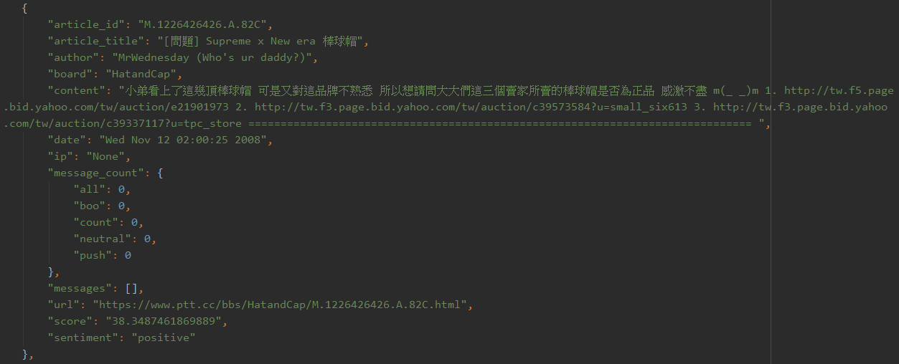

# What is PTT-SentimentAnalyzer

PTT-SentimentAnalyzer is a sentiment analyzer that determines whether a PTT board article is positive or negative.

## Run app for Local

1. Clone PTT-SentimentAnalyzer repository
    ```shell
    git clone https://github.com/sean830314/PTT-SentimentAnalyzer.git
    ```
2. run app
    ```shell
    python3 app.py --config "config.yaml"
    ```
## dataset example
[dataset example](./data)

## Result
####positive


####negative


## References
- [jieba](https://github.com/fxsjy/jieba)

